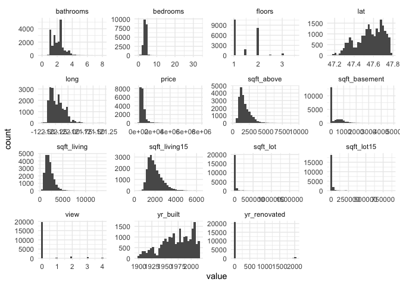

Load `tidyverse` and `tidymodels` libraries and set the theme (optional).


```r
library(tidyverse)         # for reading in data, graphing, and cleaning
```

```
## ── Attaching packages ─────────────────────────────────────── tidyverse 1.3.0 ──
```

```
## ✓ ggplot2 3.2.1     ✓ purrr   0.3.3
## ✓ tibble  3.0.1     ✓ dplyr   1.0.0
## ✓ tidyr   1.0.0     ✓ stringr 1.4.0
## ✓ readr   1.3.1     ✓ forcats 0.4.0
```

```
## ── Conflicts ────────────────────────────────────────── tidyverse_conflicts() ──
## x dplyr::filter() masks stats::filter()
## x dplyr::lag()    masks stats::lag()
```

```r
library(tidymodels)        # for modeling
```

```
## ── Attaching packages ────────────────────────────────────── tidymodels 0.1.0 ──
```

```
## ✓ broom     0.5.6      ✓ rsample   0.0.5 
## ✓ dials     0.0.7      ✓ tune      0.1.0 
## ✓ infer     0.5.2      ✓ workflows 0.1.1 
## ✓ parsnip   0.1.1      ✓ yardstick 0.0.6 
## ✓ recipes   0.1.13
```

```
## ── Conflicts ───────────────────────────────────────── tidymodels_conflicts() ──
## x scales::discard() masks purrr::discard()
## x dplyr::filter()   masks stats::filter()
## x recipes::fixed()  masks stringr::fixed()
## x dplyr::lag()      masks stats::lag()
## x yardstick::spec() masks readr::spec()
## x recipes::step()   masks stats::step()
```

```r
library(moderndive)        # for King County housing data
theme_set(theme_minimal()) # my favorite ggplot2 theme :)
```

Read in the King County Housing data and take a look at the first 5 rows.


```r
data("house_prices")

house_prices %>% 
  slice(1:5)
```

<div data-pagedtable="false">
  <script data-pagedtable-source type="application/json">
{"columns":[{"label":["id"],"name":[1],"type":["chr"],"align":["left"]},{"label":["date"],"name":[2],"type":["date"],"align":["right"]},{"label":["price"],"name":[3],"type":["dbl"],"align":["right"]},{"label":["bedrooms"],"name":[4],"type":["int"],"align":["right"]},{"label":["bathrooms"],"name":[5],"type":["dbl"],"align":["right"]},{"label":["sqft_living"],"name":[6],"type":["int"],"align":["right"]},{"label":["sqft_lot"],"name":[7],"type":["int"],"align":["right"]},{"label":["floors"],"name":[8],"type":["dbl"],"align":["right"]},{"label":["waterfront"],"name":[9],"type":["lgl"],"align":["right"]},{"label":["view"],"name":[10],"type":["int"],"align":["right"]},{"label":["condition"],"name":[11],"type":["fctr"],"align":["left"]},{"label":["grade"],"name":[12],"type":["fctr"],"align":["left"]},{"label":["sqft_above"],"name":[13],"type":["int"],"align":["right"]},{"label":["sqft_basement"],"name":[14],"type":["int"],"align":["right"]},{"label":["yr_built"],"name":[15],"type":["int"],"align":["right"]},{"label":["yr_renovated"],"name":[16],"type":["int"],"align":["right"]},{"label":["zipcode"],"name":[17],"type":["fctr"],"align":["left"]},{"label":["lat"],"name":[18],"type":["dbl"],"align":["right"]},{"label":["long"],"name":[19],"type":["dbl"],"align":["right"]},{"label":["sqft_living15"],"name":[20],"type":["int"],"align":["right"]},{"label":["sqft_lot15"],"name":[21],"type":["int"],"align":["right"]}],"data":[{"1":"7129300520","2":"2014-10-13","3":"221900","4":"3","5":"1.00","6":"1180","7":"5650","8":"1","9":"FALSE","10":"0","11":"3","12":"7","13":"1180","14":"0","15":"1955","16":"0","17":"98178","18":"47.5112","19":"-122.257","20":"1340","21":"5650"},{"1":"6414100192","2":"2014-12-09","3":"538000","4":"3","5":"2.25","6":"2570","7":"7242","8":"2","9":"FALSE","10":"0","11":"3","12":"7","13":"2170","14":"400","15":"1951","16":"1991","17":"98125","18":"47.7210","19":"-122.319","20":"1690","21":"7639"},{"1":"5631500400","2":"2015-02-25","3":"180000","4":"2","5":"1.00","6":"770","7":"10000","8":"1","9":"FALSE","10":"0","11":"3","12":"6","13":"770","14":"0","15":"1933","16":"0","17":"98028","18":"47.7379","19":"-122.233","20":"2720","21":"8062"},{"1":"2487200875","2":"2014-12-09","3":"604000","4":"4","5":"3.00","6":"1960","7":"5000","8":"1","9":"FALSE","10":"0","11":"5","12":"7","13":"1050","14":"910","15":"1965","16":"0","17":"98136","18":"47.5208","19":"-122.393","20":"1360","21":"5000"},{"1":"1954400510","2":"2015-02-18","3":"510000","4":"3","5":"2.00","6":"1680","7":"8080","8":"1","9":"FALSE","10":"0","11":"3","12":"8","13":"1680","14":"0","15":"1987","16":"0","17":"98074","18":"47.6168","19":"-122.045","20":"1800","21":"7503"}],"options":{"columns":{"min":{},"max":[10]},"rows":{"min":[10],"max":[10]},"pages":{}}}
  </script>
</div>


According to the `house_prices` documentation, "This dataset contains house sale prices for King County, which includes Seattle. It includes homes sold between May 2014 and May 2015. This dataset was obtained from [Kaggle.com](https://www.kaggle.com/harlfoxem/housesalesprediction/data)." The description of the variables in the dataset in the documentation seem to be a little off. A more accurate description is provided in the image below.

{width=400px}

Take a quick look at distributions of all the variables to check for anything irregular.


```r
house_prices %>% 
  select_if(is.numeric) %>% 
  pivot_longer(cols = everything(),names_to = "variable", values_to = "value") %>% 
  ggplot(aes(x = value)) +
  geom_histogram(bins = 30) +
  facet_wrap(vars(variable), scales = "free")
```

<!-- -->


```r
house_prices %>% 
  select_if(is.numeric) %>% 
  pivot_longer(cols = everything(),names_to = "variable", values_to = "value") %>% 
  ggplot(aes(x = value)) +
  geom_histogram(bins = 30) +
  facet_wrap(vars(variable), scales = "free")
```

<!-- -->

